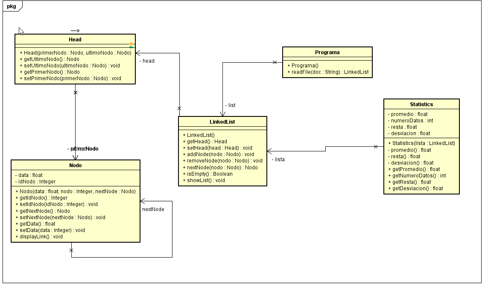

# INTRODUCTION TO COMPUTER SYSTEM DESIGN
# 2019-2  Arquitectura empresarial Grupo: 1

# Profesor
## Luis Daniel Benavides Navarro, Ph.D. 

# Integrante
## Juan Pablo Ospina Henao

# Heroku app
https://shielded-waters-61291.herokuapp.com/inputdata

# Descripción del laboratorio
### Descripción 
Este laboratorio tiene como fin, recordar el manejo de mvn y de git en un problema de estadística 
que requiere la lectura de datos de un archivo y su almacenaje con Linked List realizada por el estudiante.

# Diseño
## Arquitectura
### Spark
Metodos:
Get
Post
## Modelo E-R

